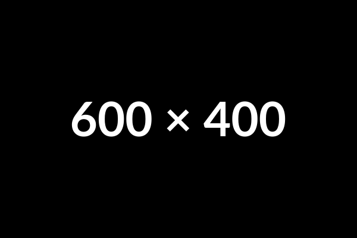

# {{Tema principal de la clase}}

## {{Subtítulo o idea clave}}
- {{Punto 1}}
- {{Punto 2}}
- {{Punto 3}}

---

# {{Tema o bloque 2}}

## {{Idea específica}}
- {{Punto 1}}
- {{Punto 2}}

{ width=40% }

---

# {{Tema o bloque 3}}

## Ejemplo de código

```js
const ejemplo = () => {
  console.log("Hola, mundo");
};
```

- {{Comentario sobre el snippet}}

---

# {{Tema o bloque 4}}

## {{Comparación / resumen visual}}
- {{Punto 1}}
- {{Punto 2}}

1. {{Idea clave A}}
2. {{Idea clave B}}
3. {{Idea clave C}}

---

# Resumen

1. {{Punto destacado}}
2. {{Punto destacado}}
3. {{Recursos o próximos pasos}}

---

# Recursos adicionales

- [{{Recurso 1}}][ex1]
- [{{Recurso 2}}][ex2]

---

# Preguntas y Discusión

¿Tienes dudas? ¡Hablemos!

[ex1]: https://one.example.com
[ex2]: https://two.example.com
