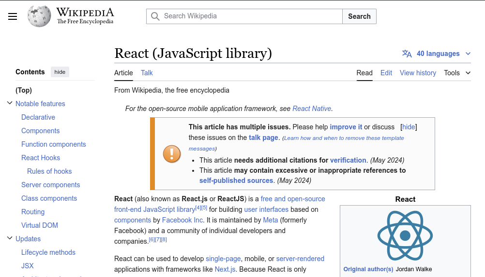

# Historia del Desarrollo Web

## HTML (1993)
[HTML](https://developer.mozilla.org/es/docs/Web/HTML) es un lenguaje de
marcado para crear estructura y contenido en la web creado por Tim Berners-Lee.

# Historia del Desarrollo Web

## HTML5 (2014)

{ width=25% }

Con su versión más reciente,
[HTML5](https://developer.mozilla.org/es/docs/Web/HTML/HTML5) , se han añadido
nuevas características como elementos semánticos, APIs para multimedia y
gráficos, y soporte para aplicaciones web *out-of-the-box*.

# Historia del Desarrollo Web

## JavaScript (1995)
Lenguaje de programación para agregar interactividad a las páginas web creado
por Brendan Eich.

# Historia del Desarrollo Web

## JavaScript (ECMAScript 2023)

{ width=25% }

Creado para manipular el DOM y validar formularios,
[JavaScript](https://developer.mozilla.org/es/docs/Web/JavaScript) se ha
convertido en un lenguaje de propósito general con soporte para programación
funcional y orientada a objetos.

# Historia del Desarrollo Web

## Páginas Web Estáticas (1990s-2000s)
Contenido pre-definido, sin interactividad dinámica.

{ width=50% }

# Historia del Desarrollo Web

## Páginas Web Dinámicas (2000s)
Introducción de tecnologías como PHP, ASP, JSP, para generar contenido dinámico
en el servidor.

{ width=50% }

# Historia del Desarrollo Web

## jQuery (2006)
Biblioteca de JavaScript para simplificar la manipulación del DOM y la
interactividad en el cliente.

{ width=25% }

# Historia del Desarrollo Web

## Frameworks y Bibliotecas (2010s)
Emergencia de tecnologías como Backbone.js, AngularJS, Ember.js, para construir
aplicaciones web complejas.

{ width=50% }

# El surgimiento de React

## React (2013)
Biblioteca de JavaScript para construir interfaces de usuario, desarrollada por
Facebook.

{ width=25% }

# El surgimiento de React

## Características clave
- Componentes reutilizables
- Virtual DOM para optimizar el rendimiento
- Programación declarativa

# El surgimiento de React

## Problemas que resuelve
- Mejora el rendimiento y la escalabilidad
- Simplifica la gestión del estado y la lógica de negocio
- Facilita la integración con otras tecnologías

# Resumen

1. Se discutió la historia del desarrollo web, desde HTML y JavaScript hasta
   las páginas web dinámicas y los frameworks modernos.
1. Se presentó React como una biblioteca para construir interfaces de usuario,
   destacando sus características clave y problemas que resuelve.
1. Se mencionaron alternativas a React, como Vue.js, Svelte y otras opciones.
