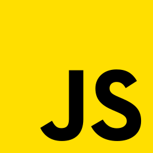
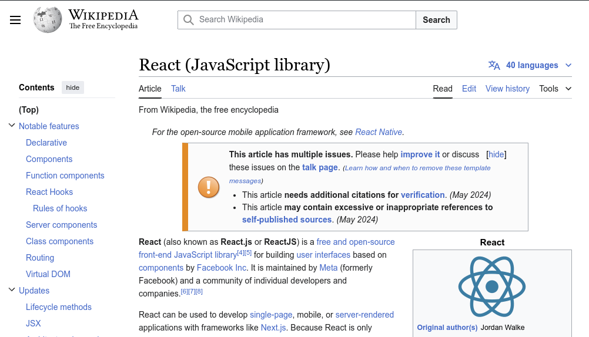
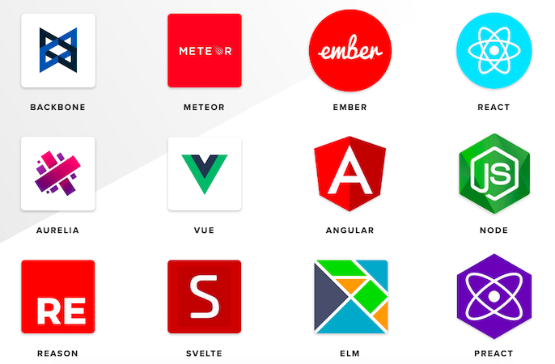
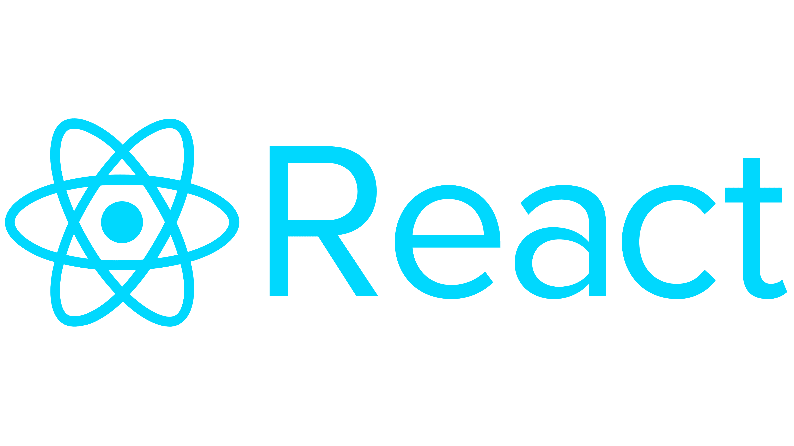

# El desarrollo web hoy

La web en su inicio servía para mostrar información estática que no cambiaba:
blogs, wikis, correo, páginas que se leían y poco más.

Las nuevas tecnologíás y la velocidad de la información trajo la necesidad de
que los servicios que respondan y cambien al instante. Ejemplos: redes
sociales, el streaming, la banca en línea o la mensajería instantánea.

---

# Separación de Intereses

Una aplicación hoy hace mucho: guardar datos, aplicar reglas, dibujar la
interfaz y responder a las interacciones. Mezclarlas en un solo bloque vuelve
el sistema difícil de mantener e imposible de escalar.

La solución de la industria es separar esos intereses (*separation of
concerns*): cada parte se ocupa de un problema y evoluciona por su cuenta. En una
aplicación web esa separación deja dos lados: 

- **backend**: datos y lógica en el servidor, el terreno de las bases de datos.
- **frontend**: la interfaz y la interacción.

---

# Evolución de la Web

La web actual no apareció de golpe. Pasó por etapas y cada una resolvió una
limitación de la anterior.

---

# Historia del Desarrollo Web

## HTML (1993)
[HTML](https://developer.mozilla.org/es/docs/Web/HTML) es un lenguaje de marcado
para crear estructura y contenido en la web, creado por Tim Berners-Lee.

---

# Historia del Desarrollo Web

## HTML5 (2014)

{ width=25% }

Con [HTML5](https://developer.mozilla.org/es/docs/Web/HTML) se añadieron
elementos semánticos, APIs de multimedia y gráficos, y soporte para
aplicaciones web sin complementos externos.

---

# Historia del Desarrollo Web

## JavaScript (1995)
Lenguaje de programación para agregar interactividad a las páginas web, creado
por Brendan Eich.

---

# Historia del Desarrollo Web

## JavaScript (ECMAScript)

{ width=25% }

Nacido para manipular el DOM y validar formularios,
[JavaScript](https://developer.mozilla.org/es/docs/Web/JavaScript) es hoy un
lenguaje de propósito general con soporte para programación funcional y
orientada a objetos.

---

# Historia del Desarrollo Web

## Páginas web estáticas (1990s-2000s)
Contenido predefinido, sin interactividad dinámica.

{ width=50% }

---

# Historia del Desarrollo Web

## Páginas web dinámicas (2000s)
Tecnologías como PHP, ASP y JSP generan contenido dinámico en el servidor.

{ width=50% }

---

# Historia del Desarrollo Web

## jQuery (2006)
Biblioteca de JavaScript para simplificar la manipulación del DOM y la
interactividad en el cliente.

{ width=25% }

---

# Historia del Desarrollo Web

## Frameworks y bibliotecas (2010s)
Aparecen Backbone.js, AngularJS y Ember.js para construir aplicaciones web más
complejas y mantenibles.

{ width=50% }

---

# El surgimiento de React

## React (2013)
Biblioteca de JavaScript para construir interfaces de usuario, desarrollada por
Facebook.

{ width=25% }

---

# El surgimiento de React

## Características clave
- Componentes reutilizables.
- Virtual DOM para optimizar el rendimiento.
- Programación declarativa.

---

# El surgimiento de React

## Problemas que resuelve
- Mejora el rendimiento y la escalabilidad.
- Simplifica la gestión del estado y la lógica de la interfaz.
- Facilita la integración con otras tecnologías.

Existen alternativas con ideas similares, como Vue.js y Svelte.

---

# Enfoque del curso

- **Qué se construye:** aplicaciones web y móviles con React.
- **Con qué se trabaja:** herramientas estándar de la industria (editor, Node,
  Git, despliegue).
- La meta no es memorizar sintaxis, sino **aprender a trabajar** como
  desarrollador: construir, versionar, documentar y entregar.

---

# De la teoría al trabajo

- Programar no es solo escribir código: es guardarlo, versionarlo y entregarlo
  de forma ordenada.
- Todo lo que construyas en el curso se entrega como **repositorio**.
- La primera herramienta, entonces, es el **control de versiones**.

---

# Control de versiones

## El problema
Cuando guardas copias del proyecto para no perder lo anterior, terminas con
archivos imposibles de seguir.

**Ejemplo:**
`tarea.js`, `tarea_v2.js`, `tarea_final.js`, `tarea_final_definitivo.js`.
No hay forma de saber cuál es la buena ni qué cambió entre una y otra.

---

# Control de versiones

## La idea
Un sistema de control de versiones guarda el historial completo del proyecto y
te permite volver a cualquier punto anterior.

No es guardar `tarea_v2` y `tarea_final` por separado: es una sola carpeta con
un historial donde cada commit es una "foto" a la que puedes volver.

---

# Git y GitHub

## Git
Git es un programa que corre en tu computador y administra el historial de
cambios de un proyecto.

- Guarda cada cambio que confirmas.
- Te deja comparar, volver atrás y trabajar en paralelo.
- Es el estándar que vas a encontrar en cualquier empresa.

---

# Git y GitHub

## Git no es GitHub
- **Git:** el programa local que registra los cambios.
- **GitHub:** un servicio en internet donde subes y compartes tus repositorios.

**Ejemplo:** Git es tu cuaderno de borradores; GitHub es la nube donde lo
respaldas y lo entregas. Existen otros como GitLab o Bitbucket.

---

# Configuración inicial

Antes de tu primer commit, Git necesita saber quién eres. Se configura una sola
vez por computador y queda registrado en cada commit.

```bash
git config --global user.name "Tu Nombre"
git config --global user.email "tu@correo.com"
```

---

# Ordenar tu área de trabajo

Un proyecto vive en una sola carpeta, y esa carpeta es un repositorio. No anides
un repositorio dentro de otro y evita los espacios en los nombres.

- Bien: `tarea-01-landing`
- Mal: `Tarea Final (1)`

---

# Crear un repositorio

Creas la carpeta del proyecto y la conviertes en repositorio. Recién ahí Git
empieza a seguir tus cambios.

```bash
mkdir mi-proyecto
cd mi-proyecto
git init
```

- Sin `git init`, Git responde `fatal: not a git repository`.
- `git init` crea la carpeta oculta `.git/`: eso la hace un repo. **No la toques.**

---

# El archivo .gitignore

Versionas tu código fuente. No versionas lo que se regenera, lo que es enorme o
lo que es **secreto**.

```bash
# .gitignore
node_modules/
dist/
.env  # subir este archivo le costó su trabajo a más de un dev
```

`node_modules/` pesa cientos de MB y se reconstruye con un comando: no tiene
sentido versionarlo.

---

# El flujo básico

## Tres áreas
Tu trabajo pasa por tres etapas antes de quedar guardado en el historial.

- **Working directory:** los archivos que estás editando.
- **Staging:** lo que marcas para el próximo commit.
- **Repositorio:** los cambios ya confirmados.

---

# El flujo básico

## En comandos

```bash
git status            # ver qué cambió
git add archivo.js    # preparar un cambio
git commit -m "Agrega formulario de login"
```

**Ejemplo:** editaste tres archivos, pero solo terminaste uno. Lo agregas y
haces commit. Los otros quedan para después.

---

# El flujo básico

## Cuidado con `git add .`
`git add .` prepara de una vez todos los cambios pendientes. Se puede usar, pero
hacerlo a ciegas es la raíz de problemas grandes.

- Antes de agregar, revisa con `git status` qué va a entrar.
- Un `git add .` sin mirar sube `node_modules/`, un `.env` con claves o un
  archivo a medio terminar.

---

# Repositorios remotos y GitHub

El repositorio remoto es la copia que vive en GitHub. Créalo vacío en tu cuenta,
conecta tu repo local una vez y desde ahí envías tus commits.

```bash
git remote add origin https://github.com/usuario/repo.git
git push -u origin main
```

**Ejemplo:** puedes apuntar a `github.com/torvalds/linux.git`, pero el `push`
falla: ese repo no es tuyo.

---

# Clonar y sincronizar

- `git clone`: descarga un repositorio completo a tu máquina.
- `git pull`: trae los cambios nuevos del remoto.
- `git push`: envía tus commits.

**Ejemplo:** trabajas en el laboratorio y haces `push`. Llegas a casa, haces
`pull` y sigues donde quedaste.

---

# Buenas prácticas de commits

- Pequeños y frecuentes, cada uno con un propósito.
- Mensaje en imperativo y claro: "Agrega login", no "cambios".
- Mejor un commit que funciona que uno enorme y roto.
- Recuerda: `.gitignore` solo ignora lo que **aún no** rastreas.

---

# El README

El `README.md` es el archivo que GitHub muestra al abrir el repositorio: explica
qué es el proyecto y cómo usarlo.

- `.md` es Markdown: texto plano con formato simple (títulos, listas, enlaces).
- Va en mayúsculas por convención, para que sea lo primero que se lee.

**Ejemplo:** es lo primero que ve quien llega a tu repo. Sin README, es una caja
sin etiqueta.

---

# La entrega es un repositorio

En este curso, entregar significa mostrar un repositorio, no un `.zip` por
correo.

- Un `README.md` que explique qué es y cómo ejecutarlo.
- Estructura de carpetas ordenada.
- Historial de commits que muestre tu avance.
- El enlace al repositorio en GitHub.

---

# Comandos esenciales

```bash
git init          # crear repo local
git status        # estado actual
git add archivo   # preparar un cambio
git commit -m ""  # confirmar cambios
git push          # subir al remoto
git pull          # actualizar desde el remoto
git log --oneline # ver historial
```

---

# Actividad

Crea el repositorio con el que entregarás durante el curso.

1. Crea el repositorio en GitHub y clónalo (o inicialízalo local y conéctalo).
2. Agrega un `README.md` con tu nombre y el propósito del repo.
3. Agrega un `.gitignore` acorde al proyecto.
4. Haz tu primer commit y súbelo con `push`.
5. Entrega el enlace al repositorio.

---

# Resumen

- La web de hoy son aplicaciones interactivas; llegamos aquí por etapas que
  culminan en React.
- El curso enseña a trabajar como desarrollador: construir, versionar y
  entregar.
- Git versiona tu trabajo; GitHub lo aloja y lo comparte.
- Flujo: editar, `add`, `commit`, `push`. Un proyecto, una carpeta, un
  repositorio.
- Tus tareas se entregan como repositorio.

---

# Recursos adicionales

- [Documentación de JavaScript (MDN)][mdn]
- [Documentación oficial de Git][git]
- [Guías de GitHub][gh]
- [Pro Git (libro gratuito)][progit]

---

# Preguntas y Discusión

¿Tienes dudas? ¡Hablemos!

[mdn]: https://developer.mozilla.org/es/docs/Web/JavaScript
[git]: https://git-scm.com/doc
[gh]: https://docs.github.com/es/get-started
[progit]: https://git-scm.com/book/es/v2
