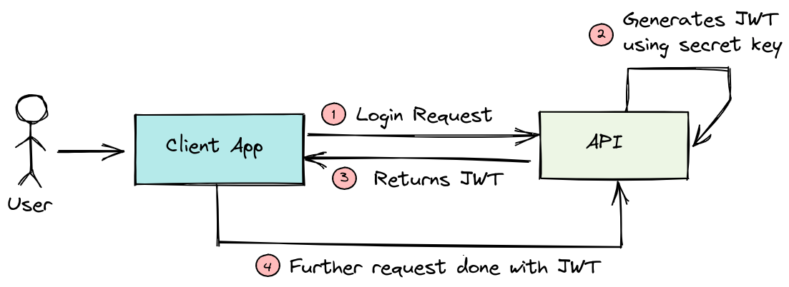

# Introducción a OAuth2 y Autenticación con JWT

## ¿Qué es OAuth2?

- OAuth2 es un protocolo de autorización que permite a las aplicaciones obtener acceso limitado a recursos en nombre del usuario sin necesidad de almacenar su contraseña.
- Utiliza un proceso de tokens, donde un cliente recibe un token temporal para acceder a los recursos.
- Comúnmente usado en aplicaciones web y móviles para permisos de terceros.

# Flujo de OAuth2

# ¿Qué es JWT?

- JSON Web Token (JWT) es un estándar (RFC 7519) para crear tokens que verifican la identidad de un usuario y pueden contener datos adicionales.

# Ventajas de los JWT

- **Compacto**: Fácil de enviar a través de headers HTTP.
- **Seguro**: La firma asegura la integridad de los datos.
- **Auto-contenido**: Puede incluir toda la información necesaria para autenticación.

# Autenticación con JWT

1. **Inicio de sesión**: El usuario ingresa sus credenciales.
2. **Generación del token**: El servidor genera un JWT y lo devuelve al cliente.
3. **Autenticación continua**: En cada solicitud, el cliente envía el token en el header de autorización.
4. **Verificación**: El servidor verifica el token en cada solicitud para validar la identidad del usuario.

# OAuth2 y JWT Juntos

- OAuth2 y JWT se combinan frecuentemente para implementar **autenticación sin estado** (stateless authentication).
- En este esquema, OAuth2 maneja la autorización y el JWT contiene la identidad del usuario, permitiendo así que el servidor autentique sin guardar sesiones.

# Resumen

- **OAuth2** permite la autorización de recursos sin compartir credenciales.
- **JWT** permite que los servidores mantengan autenticación sin almacenar sesiones.
