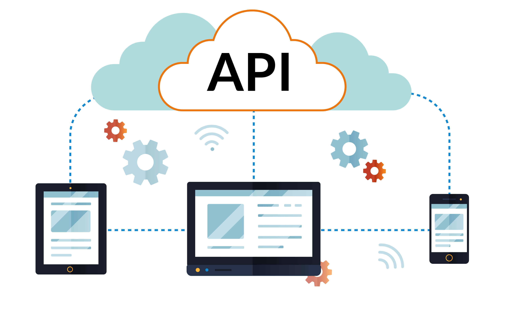
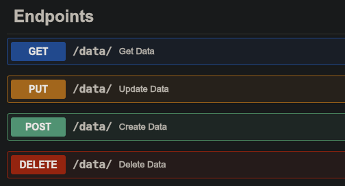
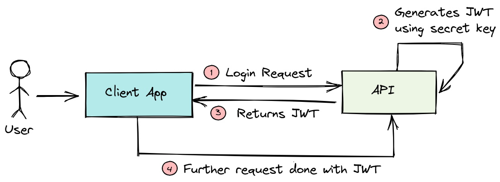

# Introducción

* Qué es una API y para qué se usa.
* REST, métodos HTTP y códigos de respuesta.
* Consumir una API desde React con `fetch`.
* Autenticación con OAuth2 y tokens.

---

# ¿Qué es una API?

* **Application Programming Interface**.
* Conjunto de definiciones y protocolos para que dos programas se comuniquen.
* Expone datos o funcionalidad sin mostrar cómo están implementados.

{ width=40% }

---

# ¿Para qué se usan?

* **Interacción entre aplicaciones**: una app envía mensajes a través de otra.
* **Acceso a datos**: clima, finanzas, mapas.
* **Integración de servicios**: pagos, autenticación, notificaciones.

Casi toda app moderna es un frontend que conversa con varias APIs.

---

# REST

* Estilo de arquitectura para servicios web.
* Funciona sobre HTTP.
* Cada recurso se identifica con una URL.
* La representación del recurso viaja en JSON.

```
https://jsonplaceholder.typicode.com/users
https://jsonplaceholder.typicode.com/users/1
```

---

# Métodos HTTP

La URL dice **cuál** recurso. El método dice **qué** hacer con él.

* `GET` lee un recurso.
* `POST` crea uno nuevo.
* `PUT` reemplaza uno existente.
* `PATCH` modifica parte de uno existente.
* `DELETE` lo elimina.
* `QUERY` consulta enviando el criterio en el body, sin modificar nada.

`QUERY` es reciente, RFC 10008 de junio de 2026. Cubre las búsquedas cuyo
criterio no cabe en la URL y que hoy se hacen con `POST`, aunque no modifiquen
nada. Los navegadores todavía no lo soportan.

---

# Métodos HTTP

{ width=65% }

---

# Códigos de respuesta

* `2xx` la petición salió bien.
* `4xx` el cliente se equivocó, como un `404` o un `401`.
* `5xx` el servidor falló.

`fetch` solo falla si la red falla. Un `404` llega como una respuesta normal y
hay que revisarlo a mano.

---

# El 200 que esconde un error

Mala práctica frecuente: la API responde `200` y avisa del error dentro del JSON.

```
HTTP/1.1 200 OK

{
  "success": false,
  "error": "Usuario no encontrado"
}
```

* `r.ok` es `true`, el `catch` nunca corre y la UI muestra vacío como si todo
  estuviera bien.
* Si un recurso no existe, corresponde `404`. Si las credenciales fallan, `401`.

---

# Características de REST

* **Stateless**: el servidor no recuerda peticiones anteriores.
* **Cliente-servidor**: las dos partes evolucionan por separado.
* **Cacheable**: las respuestas se pueden almacenar.

---

# Otros paradigmas

## GraphQL

* El cliente define la forma de la respuesta.
* Backend más complejo.

## gRPC

* Comunicación binaria eficiente.
* Poco amigable desde el frontend.

## SOAP

* Muy estructurado, soporta transacciones complejas.
* Más pesado y menos flexible que REST.

---

# fetch

* API nativa del navegador para peticiones HTTP.
* No es parte de React, es JavaScript del navegador.
* Retorna una *Promise* que se resuelve con la respuesta.
* `r.json()` lee el cuerpo y lo convierte en objeto de JavaScript.

```js
fetch("https://jsonplaceholder.typicode.com/users")
  .then(r => r.json())
  .then(data => console.log(data));
```

---

# Alternativas a fetch

* `XMLHttpRequest`: la forma original, anterior a las promesas.
* jQuery con `$.ajax`: el estándar antes de `fetch`, hoy heredado.
* Axios: biblioteca externa, la más usada, agrega interceptores y conversión
  automática de JSON.

`fetch` es nativo y no necesita instalar nada, por eso lo usamos acá.

---

# Fetch desde un botón

El click es el disparador de la petición.

```js
function Users() {
  const [users, setUsers] = useState([]);
  const loadUsers = () =>
    fetch("https://jsonplaceholder.typicode.com/users")
      .then(r => r.json()).then(setUsers);
  return (
    <>
      <button onClick={loadUsers}>Cargar usuarios</button>
      <ul>{users.map(u => <li key={u.id}>{u.name}</li>)}</ul>
    </>
  );
}
```

---

# Estado de carga

`isLoading` parte en `false` porque no se carga nada hasta el click.

```js
const [isLoading, setIsLoading] = useState(false);

const loadUsers = () => {
  setIsLoading(true);
  fetch("https://jsonplaceholder.typicode.com/users")
    .then(r => r.json()).then(setUsers)
    .finally(() => setIsLoading(false));
};
```

---

# Manejo de errores

`r.ok` es falso para `4xx` y `5xx`, y ahí hay que lanzar el error a mano.

```js
const [error, setError] = useState(null);
const loadUsers = () => {
  setIsLoading(true);
  setError(null);
  fetch("https://jsonplaceholder.typicode.com/users")
    .then(r => {
      if (!r.ok) throw new Error(`HTTP ${r.status}`);
      return r.json();
    })
    .then(setUsers).catch(e => setError(e.message))
    .finally(() => setIsLoading(false));
};
```

---

# Render por estado

El botón debe seguir visible siempre, así que cada estado se muestra junto a él.

```js
<>
  <button onClick={loadUsers} disabled={isLoading}>
    {isLoading ? "Cargando..." : "Cargar usuarios"}
  </button>
  {error && <p>Error: {error}</p>}
  {!error && users.length === 0 && <p>Sin datos.</p>}
  <ul>{users.map(u => <li key={u.id}>{u.name}</li>)}</ul>
</>
```

---

# Enviar datos con POST

El body viaja como texto, por eso `JSON.stringify`.

```js
const createPost = () =>
  fetch("https://jsonplaceholder.typicode.com/posts", {
    method: "POST",
    headers: { "Content-Type": "application/json" },
    body: JSON.stringify({ title: "Hola", body: "Texto", userId: 1 }),
  })
    .then(r => r.json())
    .then(setPost);
```

---

# Autenticación

* La mayoría de las APIs no le responden a cualquiera.
* Hay varias formas de identificarse: API key, sesión con cookie, OAuth2.
* Usamos OAuth2, el esquema más común en aplicaciones web y móviles.

---

# Flujo OAuth2

1. El cliente envía usuario y contraseña una sola vez.
2. El servidor responde con un token temporal.
3. El cliente guarda el token.
4. Cada petición siguiente lleva ese token.
5. El servidor valida el token sin volver a pedir la contraseña.

{ width=62% }

---

# Login

Las credenciales se mandan una vez y lo que se guarda es el token.

```js
const [token, setToken] = useState(null);

const login = () =>
  fetch("https://dummyjson.com/auth/login", {
    method: "POST",
    headers: { "Content-Type": "application/json" },
    body: JSON.stringify({ username: "emilys", password: "emilyspass" }),
  })
    .then(r => r.json())
    .then(data => setToken(data.accessToken));
```

---

# Usar el token

Va en el header `Authorization` con el prefijo `Bearer`. Sin él la API
responde `401`.

```js
const loadProfile = () =>
  fetch("https://dummyjson.com/auth/me", {
    headers: { Authorization: `Bearer ${token}` },
  })
    .then(r => r.json())
    .then(setProfile);
```

---

# Buenas prácticas

1. Siempre dar feedback: cargando, error, sin datos.
2. Validar `response.ok` antes de `r.json()`.
3. Deshabilitar el botón mientras la petición está en curso.
4. Preparar la UI para datos vacíos.
5. Nunca escribir un token en el código fuente.

---

# Resumen

* Una API REST expone recursos por URL sobre HTTP.
* El método dice qué hacer: `GET`, `POST`, `PUT`, `PATCH`, `DELETE`.
* `fetch` hace la petición y el evento del botón decide cuándo.
* `isLoading` y `error` son parte del estado, no un detalle.
* OAuth2 cambia usuario y contraseña por un token que viaja en `Authorization`.

---

# Preguntas y Discusión

¿Tienes dudas? ¡Hablemos!
