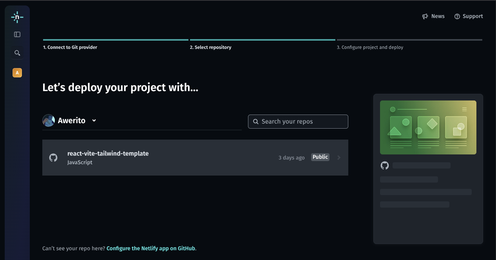
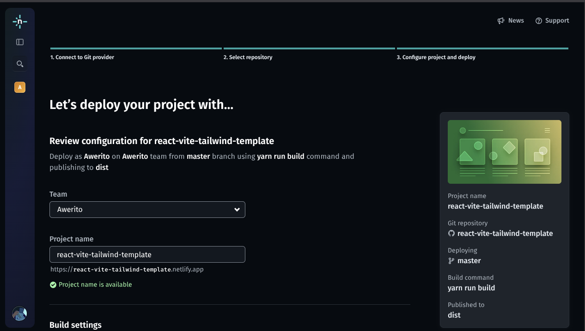
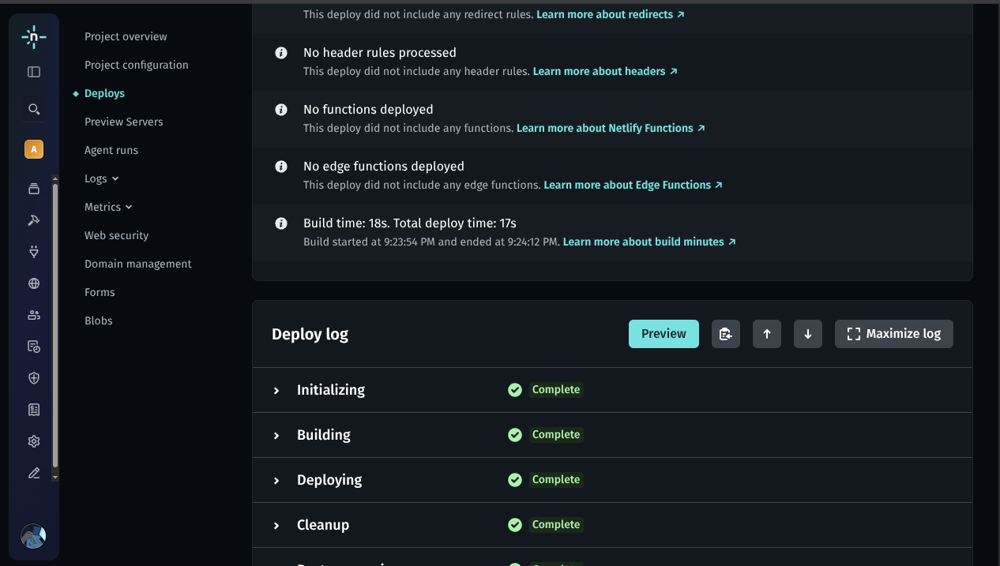

# React Build: Construyendo y Desplegando Aplicaciones

## Del entorno local a producción
- Todo proyecto React requiere un proceso de **compilación (build)** antes de
desplegar.
- El objetivo del build es **optimizar**: minificar, agrupar y preparar para
servidores estáticos.
- Herramientas comunes: **Vite**, **esbuild**, **Rollup**, **Webpack**.

---

# Etapa 1: Build local con Vite

## Comando base
```bash
yarn build
````

* Genera la carpeta `dist/` con archivos listos para producción.
* Usa `vite.config.js` y variables de entorno que comienzan con `VITE_`.
* Revisa tamaños finales de JS/CSS y elimina dependencias innecesarias.

---

# Estructura del build

## Carpeta `dist/`

```
dist/
├─ index.html
├─ assets/
│  ├─ main-8bd73c.js
│  └─ style-11f2.css
```

* `index.html` es el punto de entrada.
* Los archivos en `assets/` están **hashados** para caché eficiente.
* Se debe servir **todo el contenido estáticamente** (sin backend).

---

# Etapa 2: Probar el build localmente

## Comando de previsualización

```bash
yarn preview
```

* Inicia un servidor local (por defecto en `http://localhost:4173`).
* Permite revisar rutas, assets y variables antes del despliegue.
* Ideal para simular el entorno productivo.

---

# Etapa 3: Variables de entorno

## Variables en tiempo de build

* Solo las variables que comienzan con `VITE_` se inyectan al bundle.
* Ejemplo:

  ```bash
  VITE_API_BASE_URL=https://api.example.com
  ```
* No incluir secretos ni claves privadas.
* Los valores sensibles deben manejarse desde el backend o desde la plataforma
  (Netlify env vars).

---

# Etapa 4: Desplegar con Netlify

## Introducción

* Netlify permite publicar sitios estáticos **directamente desde GitHub**.
* Cada push al repositorio puede **reconstruir y desplegar automáticamente**.
* Ideal para proyectos React con Vite, sin necesidad de servidores manuales.

> La ventaja de Netlify es su integración con CI/CD y facilidad de uso, y es
> gratis para proyectos pequeños y medianos.

---

# Paso 1: Conectar el repositorio

## Desde el panel de Netlify

1. Inicia sesión en [netlify.com][1].
2. Selecciona **“Add new site → Import an existing project”**.
3. Conecta tu cuenta de **GitHub** (o GitLab/Bitbucket).
4. Elige el repositorio del proyecto React.

{ width=50% }

---

# Paso 2: Configurar el build

## Ajustes iniciales

* **Build command:** `yarn build`
* **Publish directory:** `dist`
* Netlify detecta automáticamente que es un proyecto Vite/React.
* Puedes añadir variables en **Site settings → Environment variables**.

{ width=45% }

---

# Paso 3: Publicar y verificar

## Primer despliegue

* Al hacer clic en **Deploy site**, Netlify ejecutará el build y publicará el
resultado.
* URL temporal generada automáticamente:
`https://<nombre-configurado>.netlify.app`
* Puedes cambiar el nombre del dominio en **Site settings → Domain
management**.
* El nombre configurado debe ser único en Netlify como si fuera un nombre de
usuario.

---

# Paso 4: Actualizaciones automáticas

## CI/CD integrado

* Cada vez que haces **push a main** o **merge a PR**, Netlify:

  1. Ejecuta `yarn build`
  2. Publica los nuevos archivos en el dominio
* Puedes revertir a versiones anteriores desde el panel (“Deploys → Rollback”).

{ width=45% }

---

# Comparación visual

| Etapa      | Herramienta      | Resultado                       |
| ---------- | ---------------- | ------------------------------- |
| Desarrollo | `yarn dev`       | Hot Reload, entorno local       |
| Build      | `yarn build`     | Archivos minificados en `dist/` |
| Preview    | `yarn preview`   | Simula entorno productivo       |
| Deploy     | Servicio elegido | Sitio público online            |

---

# Consejos finales

1. Mantén `vite.config.js` actualizado con el `base` correcto (si el sitio no
   está en `/`).
2. Usa `.env` local para desarrollo y **env vars** para producción.
3. Valida que las rutas SPA (React Router) funcionen con `redirects`.

---

# Resumen

1. El build convierte tu código React en un sitio optimizado.
2. Servicios como Netlify automatizan el deploy y CI/CD con un click.
3. Revisión previa con `yarn preview` evita errores comunes.
4. Las variables `VITE_` son la única forma de pasar configuración al cliente.

---

# Recursos adicionales

* [Guía oficial de Deploy en Netlify][2]
* [Netlify Docs][3]
* [Vite Build Command][4]
* [Environment Variables en Netlify][5]

[1]: https://www.netlify.com/
[2]: https://vitejs.dev/guide/static-deploy.html#netlify
[3]: https://docs.netlify.com/
[4]: https://vitejs.dev/guide/build.html
[5]: https://docs.netlify.com/environment-variables/overview/
