# De Web a Móvil

- Desarrollo móvil no es simplemente "web responsive".
- Requiere repensar interacciones, navegación y experiencia.
- Diferentes contextos de uso demandan diferentes soluciones.

---

# Contexto de uso

- **Web**: Escritorio, sesiones largas, multitarea activa.
- **Móvil**: En movimiento, sesiones cortas, atención dividida.
- **Consecuencia**: Diseño debe adaptarse al comportamiento real del usuario.

---

# Interacción táctil

- Área táctil mínima: 44x44 píxeles en iOS, 48x48dp en Android.
- No existe hover en móvil: feedback inmediato al tocar.
- Gestos naturales: swipe, pinch, long-press son esperados.

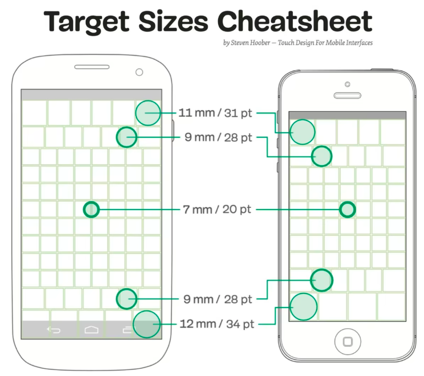{ width=38% }

---

# Navegación: Stack

- Pantallas apiladas una sobre otra.
- Botón back automático en header.
- Usuario mantiene contexto de dónde viene.

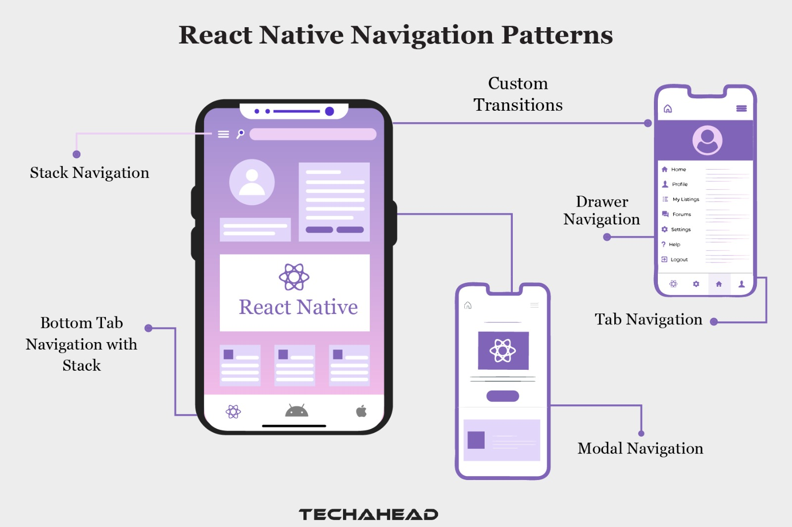{ width=45% }

---

# Navegación: Tabs

- Acceso rápido a 3-5 secciones principales.
- Siempre visible en parte inferior.
- Similar a pestañas web pero comportamiento diferente.

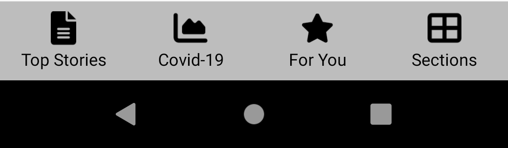{ width=45% }

---

# Navegación: Drawer

- Menú lateral deslizable.
- Para opciones secundarias o configuración.
- Común en apps con muchas secciones.

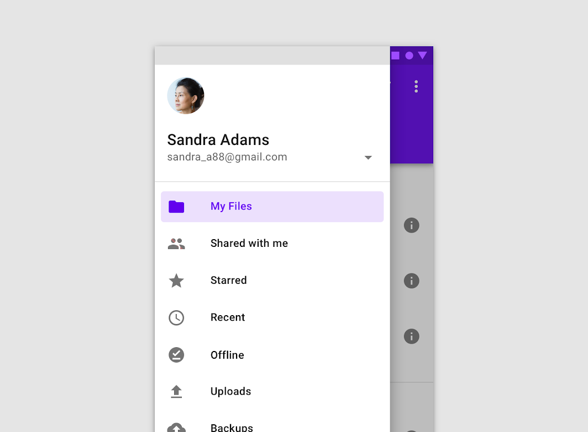{ width=40% }

---

# Ventaja: Sensores

- **Cámara**: Escaneo QR, fotos, realidad aumentada.
- **GPS**: Localización precisa, rutas, geofencing.
- **Acelerómetro/Giroscopio**: Detección de movimiento, juegos.
- **Micrófono**: Comandos de voz, grabación.
- **Biométricos**: Face ID, Touch ID, huella digital.

---

# Ventaja: Integración con OS

- App siempre accesible en home screen.
- Funcionamiento offline completo.
- Notificaciones push directas.
- Integración con sistema: compartir, widgets, shortcuts.

---

# Desventaja: Recursos limitados

- Memoria RAM limitada (2-8GB común).
- Batería drena rápido con uso intensivo.
- Almacenamiento valioso para el usuario.
- Procesamiento limitado comparado con desktop.

---

# Desventaja: Fragmentación

- Tamaños de pantalla: desde 4 pulgadas hasta tablets.
- Resoluciones: 720p hasta 4K.
- Versiones de OS: Android 8-14, iOS 13-17.
- Capacidades variables entre dispositivos.

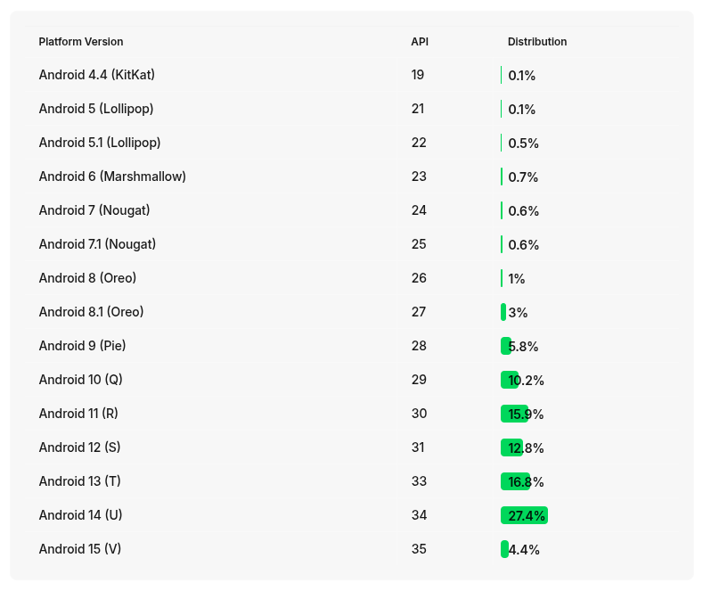{ width=37% }

---

# Desventaja: App Stores

- Apple App Store: Revisión manual 1-3 días.
- Google Play: Más rápido pero también revisa.
- Rechazos comunes: bugs, contenido inapropiado, violación de guidelines.
- Actualizaciones no instantáneas como en web.

---

# Feedback al usuario

- **Loading states**: Spinner, skeleton screens, progress bars.
- **Toast/Snackbar**: Mensaje breve en parte inferior.
- **Alert/Dialog**: Para confirmaciones importantes.
- **Haptic feedback**: Vibración sutil en acciones críticas.

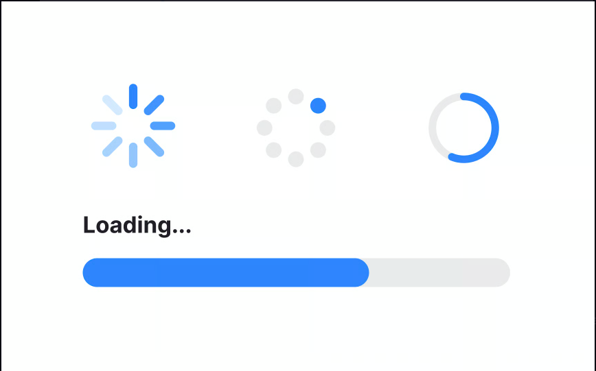{ width=50% }

---

# Estados de conexión

- Detectar pérdida de conexión automáticamente.
- Mostrar UI apropiada cuando no hay internet.
- Queue de operaciones para sincronizar después.
- Modo offline completo para funcionalidad básica.

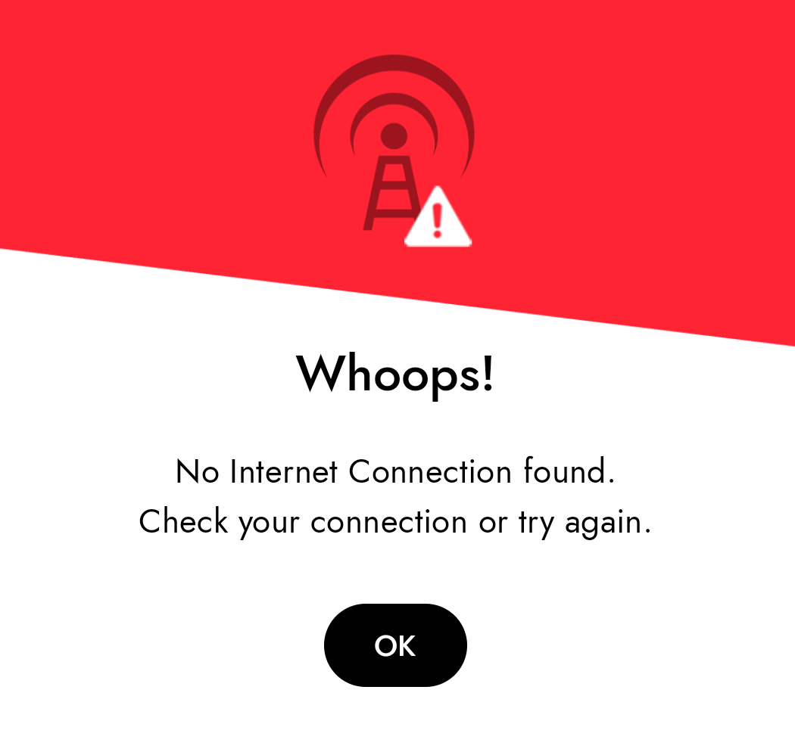{ width=38% }

---

# Rendimiento: Listas

- ScrollView renderiza TODO, incluso invisible.
- FlatList renderiza solo elementos visibles (virtualización).
- Diferencia crítica en performance móvil.
- Lazy loading de imágenes esencial.

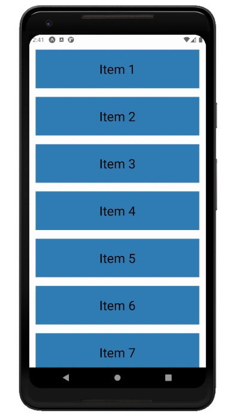{ width=30% }

---

# Estilos en React Native

- React Native usa subset de CSS.
- No hay cascada, estilos explícitos por componente.
- Flexbox por defecto, NO hay CSS Grid.
- Unidades: números sin px/rem/em.

---

# iOS vs Android

- **Navegación**: Back button físico en Android, gesture en iOS.
- **UI Components**: Material Design vs Human Interface Guidelines.
- **Permisos**: Flujo diferente en cada plataforma.
- **Tipografía**: San Francisco (iOS), Roboto (Android).

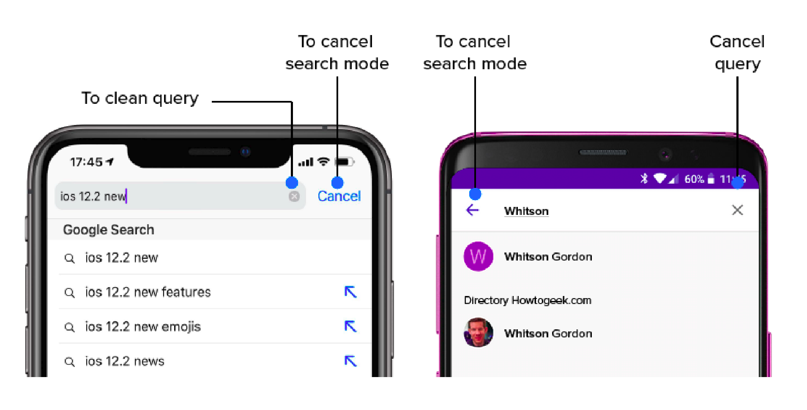{ width=55% }

---

# Permisos y privacidad

- Explicar POR QUÉ necesitas el permiso antes de solicitarlo.
- Solicitar en el momento justo, no al abrir app.
- Manejar rechazo con gracia, ofrecer funcionalidad alternativa.
- iOS más estricto que Android en privacidad.

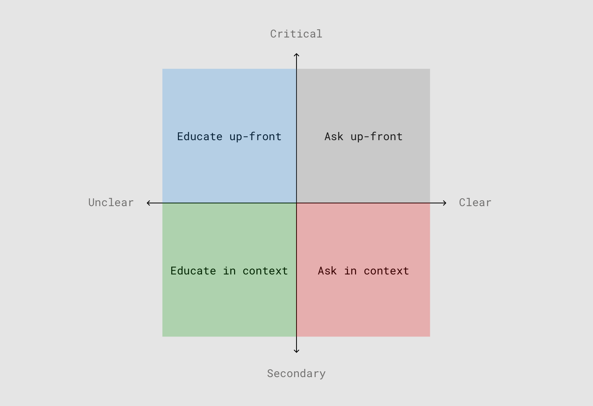{ width=45% }

---

# Testing en dispositivos

- Emulador/Simulador: Rápido pero impreciso.
- Dispositivo real necesario para: GPS, cámara, sensores, performance.
- Probar en múltiples tamaños y versiones.
- Usuarios tienen dispositivos viejos, no flagship.

---

# Accesibilidad móvil

- VoiceOver en iOS, TalkBack en Android.
- Etiquetas descriptivas en todos los elementos interactivos.
- Contraste mínimo WCAG AA obligatorio.
- Tamaño de fuente ajustable por sistema operativo.

---

# Animaciones

- Animaciones deben correr en UI thread nativo.
- JavaScript puede causar jank y stuttering.
- Usar propiedades animables: opacity, transform.
- Evitar animar: width, height, margins dinámicos.

---

# Gestos nativos

- **Swipe**: Navegación back, eliminar items de lista.
- **Pull to refresh**: Actualizar contenido.
- **Pinch**: Zoom en imágenes y mapas.
- **Long press**: Menú contextual, acciones secundarias.

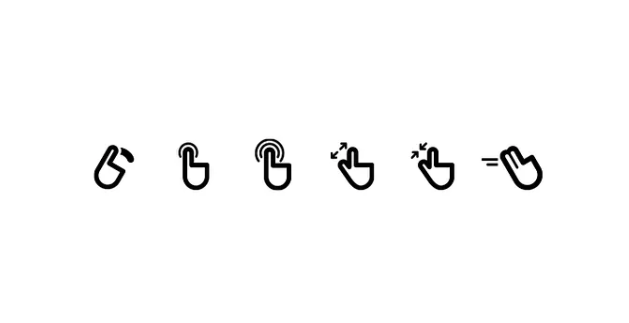{ width=50% }

---

# Imágenes en móvil

- Dimensiones explícitas siempre requeridas.
- Múltiples resoluciones: @1x, @2x, @3x para diferentes densidades.
- Formatos: PNG, JPG, WebP (mejor compresión).
- Lazy loading crítico para performance y datos.

---

# Teclado

- Teclado puede cubrir 40-60% de pantalla.
- UI debe ajustarse automáticamente (KeyboardAvoidingView).
- ScrollView para contenido largo en formularios.
- Diferentes tipos de teclado: email, number, phone, url.

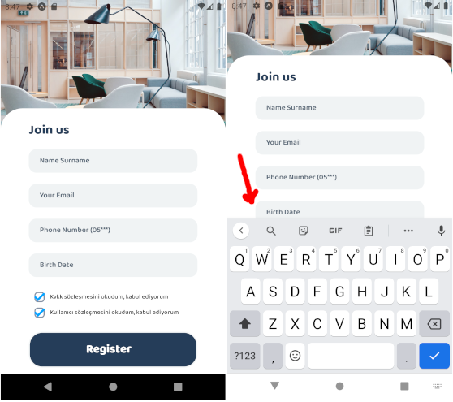{ width=35% }

---

# App Lifecycle

- **Active**: App en uso, usuario interactuando.
- **Background**: App pausada pero en memoria.
- **Inactive**: Transición entre estados.
- **Terminated**: App cerrada completamente por sistema.

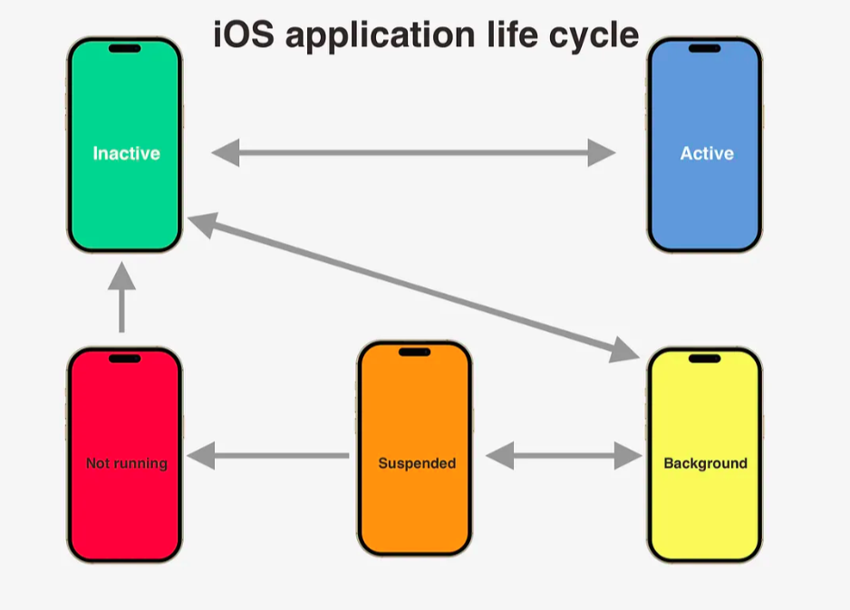{ width=44% }

---

# Notificaciones Push

- Local notifications: Programadas en dispositivo.
- Remote notifications: Enviadas desde servidor.
- Requiere permisos explícitos del usuario.
- Rich notifications: Imágenes, acciones rápidas.

---

# Deep Linking

- Universal Links (iOS) / App Links (Android).
- Abrir contenido específico desde navegador o email.
- Integración con redes sociales y compartir.
- Flujo: Email > Click link > Abre app en sección específica.

---

# Arquitectura Offline-first

- Datos críticos guardados en almacenamiento local.
- Sincronización automática cuando hay conexión.
- UI funcional incluso offline.
- Queue de operaciones pendientes para sincronizar.

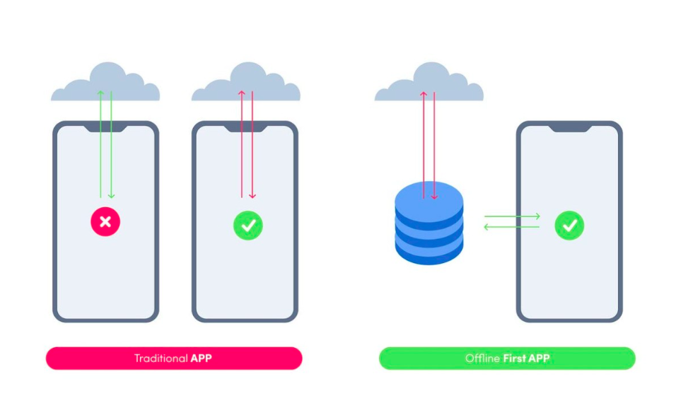{ width=50% }

---

# Seguridad móvil

- Datos sensibles en Keychain (iOS) o Keystore (Android).
- Certificados SSL pinning para prevenir MITM.
- Ofuscación de código en builds de producción.
- Detección de jail-break/root para apps sensibles.

---

# Distribución

- **App Store / Google Play**: Público general, máximo alcance.
- **TestFlight / Internal Testing**: Beta testers privados.
- **Enterprise Distribution**: Apps corporativas internas.
- **APK directo**: Solo Android, fuera de Play Store.

---

# Monetización

- **Gratuita con ads**: Ingresos por publicidad (AdMob, etc).
- **Freemium**: Funcionalidad básica gratis, premium paga.
- **Pago único**: Costo por descarga inicial.
- **Suscripción**: Pago recurrente mensual o anual.

---

# Métricas móviles

- **DAU/MAU**: Usuarios activos diarios/mensuales.
- **Retention**: % usuarios que vuelven día 1, 7, 30.
- **Session length**: Duración promedio de uso.
- **Crash rate**: % de sesiones con crashes.
- **Load time**: Tiempo hasta pantalla interactiva (TTI).

---

# Analytics

- **Firebase Analytics**: Gratuito, bien integrado.
- **Mixpanel**: Eventos y funnels avanzados.
- **Amplitude**: Análisis de comportamiento detallado.
- **Sentry**: Crash reporting y tracking de errores.

---

# Web vs Móvil

| Aspecto | Web | Móvil |
|---------|-----|-------|
| Deploy | Instantáneo | 1-3 días review |
| Actualización | Automática | Usuario decide |
| Offline | Service Workers | Nativo completo |
| Sensores | Limitado | Acceso total |
| Navegación | URL-based | Stack/Tab |
| Performance | Más tolerante | Crítico |

---

# Casos de uso

**Mejor para Web:**
- Contenido público y SEO importante.
- Actualizaciones muy frecuentes.
- No requiere sensores del dispositivo.

**Mejor para Móvil:**
- Necesita GPS, cámara, notificaciones push.
- Uso offline extensivo requerido.
- Experiencia más personal e integrada con OS.

---

# Progressive Web Apps

- Web que se comporta como app móvil.
- Instalable en home screen sin tiendas.
- Funcionalidad offline con Service Workers.
- Notificaciones push (limitadas en iOS).

---

# React Native: Ventajas

- Código compartido 80-95% entre iOS y Android.
- JavaScript conocido, curva de aprendizaje menor.
- Hot reload acelera desarrollo significativamente.
- Comunidad grande, muchas librerías disponibles.

---

# React Native: Limitaciones

- Performance no igual a nativo puro (Swift/Kotlin).
- Bridge JS-Native puede causar bottlenecks.
- Algunos componentes nativos requieren código específico.
- Actualizaciones de RN pueden introducir breaking changes.

---

# Herramientas del ecosistema

- **Expo**: Desarrollo rápido, menos configuración nativa.
- **React Navigation**: Librería de navegación estándar.
- **Redux/Zustand**: Gestión de estado global.
- **React Query**: Cache y sincronización de datos.
- **NativeWind**: Tailwind CSS para React Native.

---

# Proceso de desarrollo

1. Desarrollo en simulador/emulador local.
2. Testing frecuente en dispositivo real.
3. Build para TestFlight o Internal Testing.
4. Beta testing con usuarios reales externos.
5. Iteración: fix bugs y ajustes basados en feedback.
6. Submit a stores para revisión oficial.
7. Release escalonado (rollout gradual 10% > 50% > 100%).

---

# Debugging

- **React Native Debugger**: Chrome DevTools para RN.
- **Flipper**: Facebook debugging platform completa.
- **Reactotron**: Logs y state inspector visual.
- **Console logs**: Via terminal con metro bundler.

---

# Guidelines de diseño

- **iOS**: Human Interface Guidelines de Apple.
- **Android**: Material Design 3 de Google.
- Respetar patrones nativos de cada plataforma cuando sea posible.
- Consistencia dentro de tu app es más importante que copiar OS.

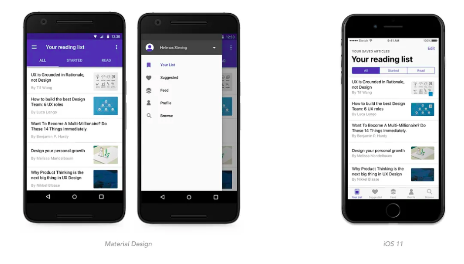{ width=55% }

---

# Errores comunes

- Asumir que móvil es simplemente "web pequeña".
- Ignorar estados de carga, error y empty states.
- No probar en dispositivos reales antiguos.
- Áreas táctiles muy pequeñas (menos de 44x44).
- No considerar el teclado en diseño de formularios.

---

# Buenas prácticas

- Diseñar primero para móvil (mobile-first thinking).
- Optimizar y comprimir todas las imágenes.
- Minimizar bundle size, code splitting cuando posible.
- Usar FlatList para listas largas, nunca ScrollView.
- Implementar retry logic en todas las network requests.
- Probar en redes lentas con throttling (3G, 2G).

---

# Tendencias futuras

- Flutter y otros frameworks multiplataforma ganando terreno.
- Progressive Web Apps cada vez más capaces.
- 5G mejora dramáticamente experiencia web móvil.
- Wearables y nuevos form factors (foldables, AR glasses).

---

# Resumen

1. Móvil y web son paradigmas diferentes, no solo tamaños distintos.
2. Móvil ofrece sensores e integración, web ofrece alcance y SEO.
3. Diseñar siempre pensando en contexto de uso real.
4. Performance y UX son mucho más críticos en móvil.
5. React Native permite código compartido con algunos compromisos.

---

# Recursos adicionales

- [Human Interface Guidelines - Apple][hig]
- [Material Design 3 - Google][material]
- [React Native Documentation][rn-docs]
- [Mobile Design Best Practices - Nielsen Norman Group][mobile-bp]

[hig]: https://developer.apple.com/design/human-interface-guidelines/
[material]: https://m3.material.io/
[rn-docs]: https://reactnative.dev/docs/getting-started
[mobile-bp]: https://www.nngroup.com/articles/mobile-usability-principles/

---

# Preguntas y Discusión

¿Tienes dudas? ¡Hablemos!
