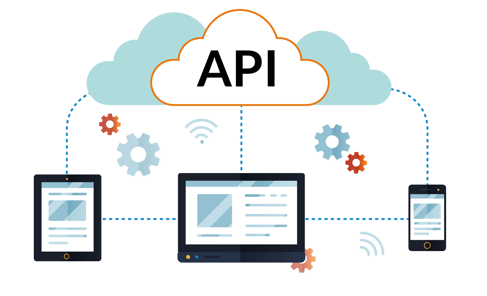
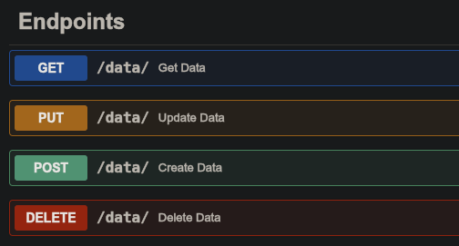

# Introducción a las APIs

## ¿Qué es una API?

- **Application Programming Interface (API)**: Es un conjunto de definiciones y
protocolos para desarrollar e integrar software.

--- 

## ¿Qué es una API?

- Las APIs permiten que diferentes aplicaciones o sistemas interactúen entre
sí.
- Se usan para acceder a funcionalidades o datos de un servicio desde un
programa.

{ width=50% }

---

### ¿Para qué se usan las APIs?

- **Interacción entre aplicaciones**: Permiten que aplicaciones hablen entre
sí, como enviar mensajes desde una app a otra.
- **Acceso a datos**: Obtener información desde servicios externos, como datos
meteorológicos o financieros.
- **Integración de servicios**: Agregar funcionalidades de terceros, como
procesadores de pago o mapas.

---

# ¿Qué es un API REST?

## Definición

- **REST (Representational State Transfer)**: Un estilo arquitectónico para
diseñar servicios web.
- Funciona sobre **HTTP**, utilizando métodos como GET, POST, PUT y DELETE.
- Los recursos (datos) son identificados por URLs y manipulados mediante
representaciones (JSON, XML, etc.).

---

## Métodos

{ width=70% }

---

## Características clave

- **Stateless**: No guarda estado entre las solicitudes.
- **Cliente-servidor**: Los clientes y servidores están desacoplados.
- **Cacheable**: Soporte para respuestas almacenables en caché.

---

# Otros paradigmas de APIs

## GraphQL

- **Ventaja**: El cliente define la estructura de la respuesta.
- **Desventaja**: Mayor complejidad en el backend.

## gRPC

- **Ventaja**: Comunicación binaria eficiente.
- **Desventaja**: No tan amigable para desarrollo en frontend.

## SOAP

- **Ventaja**: Muy estructurado y con soporte para transacciones complejas.
- **Desventaja**: Más pesado y menos flexible que REST.

---

# Resumen

- Las APIs son herramientas esenciales para la interacción entre aplicaciones.
- **REST** es un paradigma simple, eficiente y ampliamente adoptado.
- Existen otras opciones como **GraphQL**, **gRPC** y **SOAP**, cada una con
sus ventajas y desventajas.
- Consumir una API REST implica realizar solicitudes HTTP y procesar
respuestas, generalmente en formato JSON.
